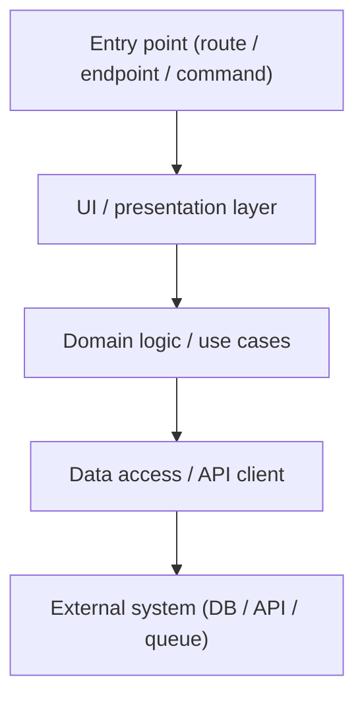
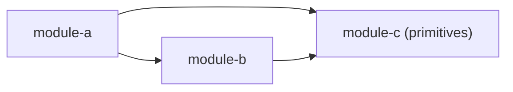

# Architecture

> Layered model for this project — how every new feature flows from entry point to data source.

<!-- TODO: Replace the placeholders below with your project's actual structure. The shape of
this page is the important part — module map, dependency rules, a worked end-to-end example.
What's in each section will be project-specific. -->

## Module map

```
<repo-root>/
  <module-a>/   Short description of what lives here.
  <module-b>/   Short description.
  <module-c>/   Short description.
  …
```

<!-- Use a flat list if you have ~10 modules. Use a tree if there's meaningful nesting.
Mention which modules are pure libraries (no dev/run lifecycle) and don't get an apps/ page. -->

## Layered model (top-down)

<!-- Replace this Mermaid diagram with your project's actual entry-point → data flow. The point
is to show the chain a request takes through the codebase, not to be exhaustive. -->



### Module dependency rules

<!-- The arrows below are the only imports allowed between modules. Add a Mermaid graph that
shows allowed edges. Then list the hard rules below. -->



**Hard rules** (encoded in the graph above):

- `module-b` must not import from `module-a`.
- `module-c` must not import from anything else — it's a primitive.
- Business logic belongs at the `<right>` layer, not inside `<wrong>` components.

<!-- Add 3–6 rules. These are the ones that, if violated, cause real harm (circular imports,
broken builds, leaking concerns). Don't list aspirations here — list invariants. -->

## Worked example: <pick a real feature>

<!-- Walk one real feature top-down. This is the most valuable section of this page because it
shows new contributors (and the LLM) what "doing it right" looks like in this codebase. Pick a
feature that exercises every layer. Cite file paths with line numbers. -->

### 1. <Entry point>

`<path/to/entry/point>:<line>`

What it does in one paragraph. What it calls into.

### 2. <Next layer>

`<path/to/next-layer>:<line>`

What it does. What state it owns vs what comes from above.

### 3. <Data layer>

`<path/to/data-call>:<line>`

The actual API/DB call. Auth. Error handling.

### 4. <External contract>

The endpoint / table / queue the feature ultimately depends on. Link to `integrations/<slug>.md`
if applicable.

## Conventions worth knowing

<!-- Patterns the code follows that aren't obvious from any single file:
- How state is managed
- How forms are built
- How errors propagate
- How tests are organized
- Anything else a new contributor would otherwise have to grep for. -->

- TODO
- TODO
- TODO
