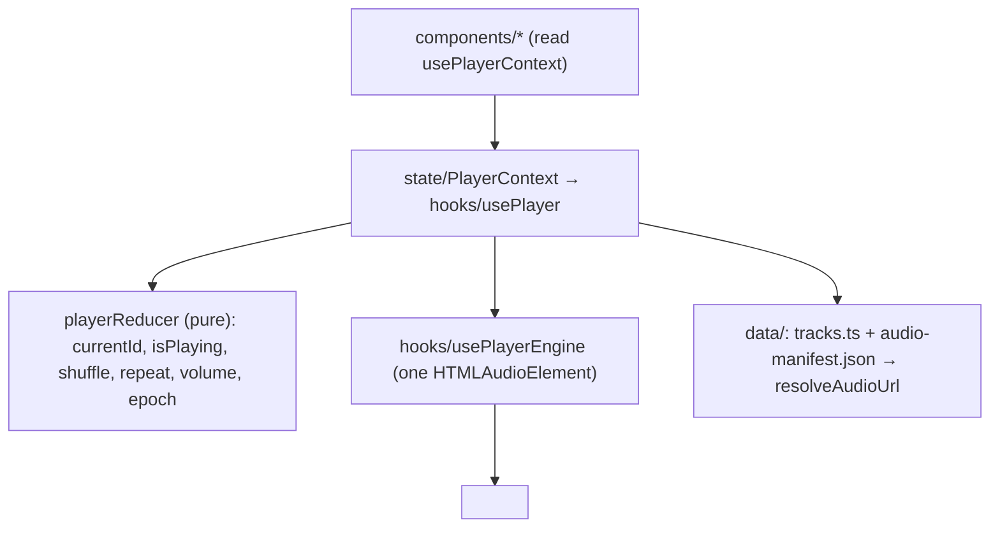

# Architecture

> A single-screen React player: data → audio engine → reducer/Context → UI, themed by CSS vars.

## Module map

```
heroes-2-music-player/
  index.html                 Root div + pre-paint theme script (sets data-theme before first paint)
  vite.config.ts             Vite (React) + Vitest (jsdom) config; @ → src alias
  scripts/build-audio.ts     OGG→MP3 transcode pipeline (run via tsx; ffmpeg/ffprobe)
  public/audio/              Generated MP3s (gitignored)
  public/art/                map-bg.jpg background (raw h2map.png gitignored)
  src/
    main.tsx                 Entry: imports theme + global CSS, mounts <App>
    App.tsx                  <PlayerProvider> → <Background/> + <PlayerPanel/>
    data/                    tracks.ts (editorial SOT), audio-manifest.json (committed receipt),
                             manifest.ts (typed manifest + resolveAudioUrl/joinUrl)
    hooks/                   usePlayerEngine (imperative HTMLAudioElement), usePlayer (reducer + wiring)
    state/                   PlayerContext (provider + usePlayerContext)
    components/              Background, PlayerPanel, TransportControls, ProgressBar, VolumeControl,
                             ThemeToggle, SettingsDialog, AlbumArt, player.css
    ui/                      GameButton, GameFrame (CSS-recreated primitives), icons.tsx
    theme/                   tokens.css (structure + good defaults), themes.css (good/evil), useTheme.ts
    test/                    manifest.test.ts, usePlayer.test.ts, setup.ts
```

Pure data/logic (`data/`, `hooks/usePlayer` reducer) has no React-DOM dependency and is unit-tested.

## Layered model (top-down)



**Rules / invariants**

- `currentTime` (the ~4 Hz tick) lives **only** in `ProgressBar` local state — never in Context.
  See [[2026-07-22-player-state]].
- The reducer (`hooks/usePlayer.ts`) is pure and side-effect free; all audio side effects happen in
  the hook's effects and in `usePlayerEngine`.
- Components never hardcode colors — they read semantic CSS vars remapped per `[data-theme]`.
  See [[2026-07-22-theming]].
- Audio hosting is decoupled: `resolveAudioUrl` prepends `VITE_AUDIO_BASE_URL` (`/audio/` in dev).
  See [[audio-hosting]].

## Worked example: playing a track

1. **Trigger** — a transport button in `components/TransportControls.tsx` calls `next()` (or
   `togglePlay`/`prev`) from `usePlayerContext()`.
2. **State** — `hooks/usePlayer.ts` dispatches to `playerReducer`, which advances `currentId` and
   bumps `epoch` (a fresh-start counter that also covers repeat-one replays).
3. **Load** — an effect keyed on `[currentId, epoch]` calls
   `engine.load(resolveAudioUrl(currentTrack.file), isPlaying)`.
4. **Engine** — `hooks/usePlayerEngine.ts` sets `el.src`, calls `el.load()`, and fires
   `void el.play().catch(...)` (autoplay-safe). URL resolved from `data/manifest.ts`.
5. **Progress** — `components/ProgressBar.tsx` (subscribed to the element's `timeupdate`) updates
   its own local time; the global tree does not re-render on the tick.
6. **End** — the element's `ended` → `usePlayerEngine` handler: repeat-one replays imperatively
   (`seek(0); play()`); otherwise it dispatches `ended`, and the reducer advances (or pauses at the
   end of the list when repeat is off).

## Conventions worth knowing

- Type-only imports use `import type`; explicit return types on hooks/helpers/reducer (eslint-config-love).
- Playback is always `void el.play().catch(...)` — never an unguarded promise.
- Audio-element listeners are registered once in `usePlayerEngine` and removed on cleanup.
- `scripts/**` is excluded from ESLint but typechecked via `tsconfig.node.json`.
- Tests: Vitest + jsdom for pure logic only (no playback assertions — jsdom's audio is a stub);
  real playback is verified with a Playwright driver. See [[2026-07-22-audio-pipeline]].
